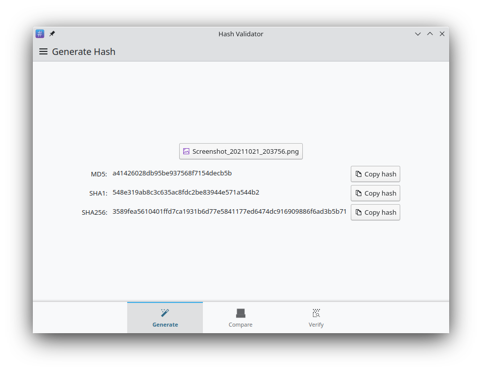
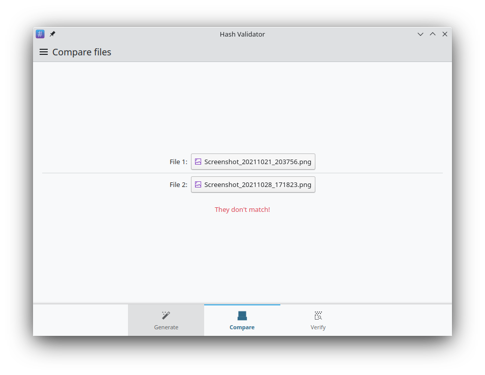
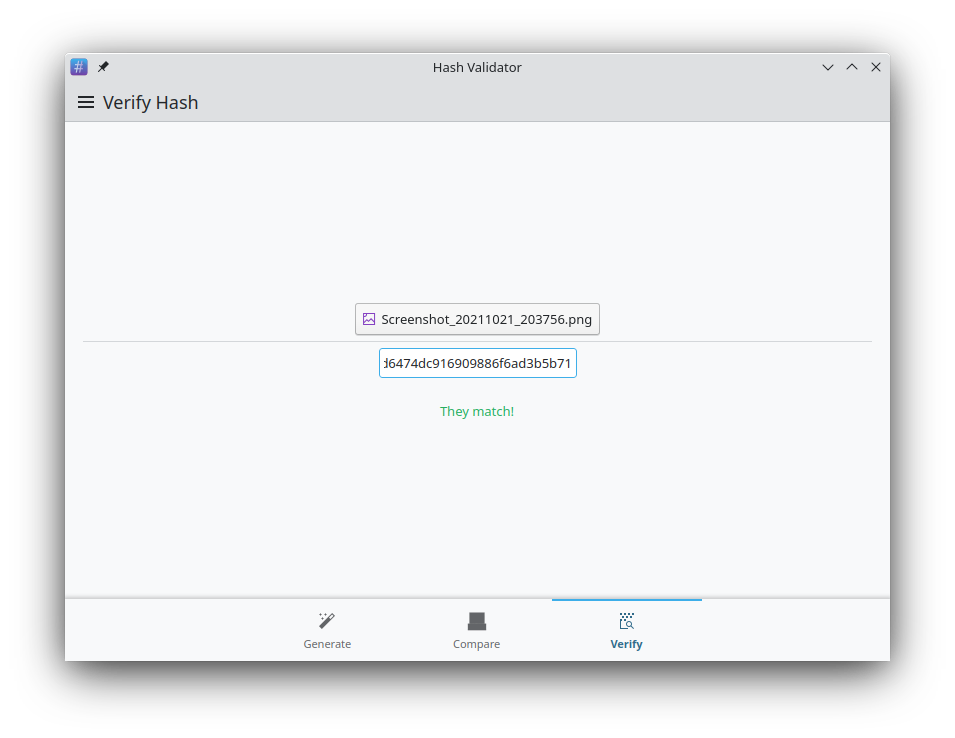

## Hash validator

Hash Validator is an application allowing to generate sha256, sha1 and md5 checksum from files.

## License

This app is licensed under LGPL-2.1-or-later.

## Credit

This application is largelly influenced by the great app [Hashbrown](https://apps.gnome.org/app/dev.geopjr.Hashbrown/)
written by [GeopJr](https://github.com/GeopJr).
